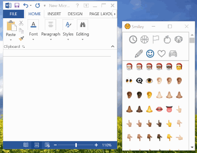

# Smiley 
An offline Electron app for using emojis in Office apps, chat apps and websites.

## Usage
* Pick an emoji. 
* The app will copy your emoji to your clipboard.
* Paste the emoji wherever you want.

Example:

## Setup
Setup file for the desktop app for Windows (32bit) can be found here: [part1](https://github.com/Lotemn102/Smiley/raw/master/smiley-win32-setup-x64.part1.rar), [part2](https://github.com/Lotemn102/Smiley/raw/master/smiley-win32-setup-x64.part2.rar), [part3](https://github.com/Lotemn102/Smiley/raw/master/smiley-win32-setup-x64.part3.rar).

## Built With
* [Electron](https://electronjs.org/)
* [This](https://github.com/eladkarako/whatsapp-emoji) emojis collection

